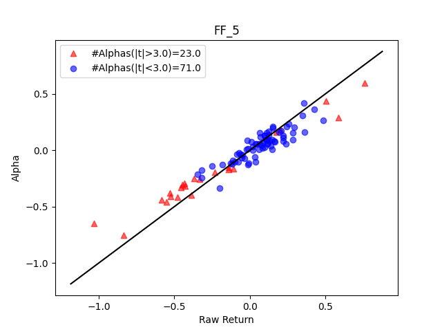
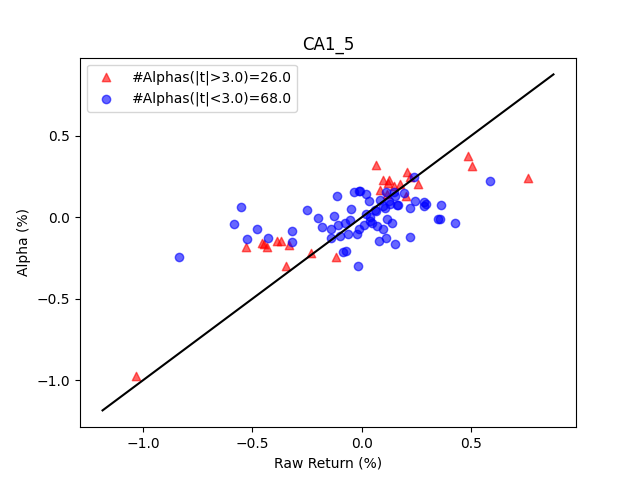
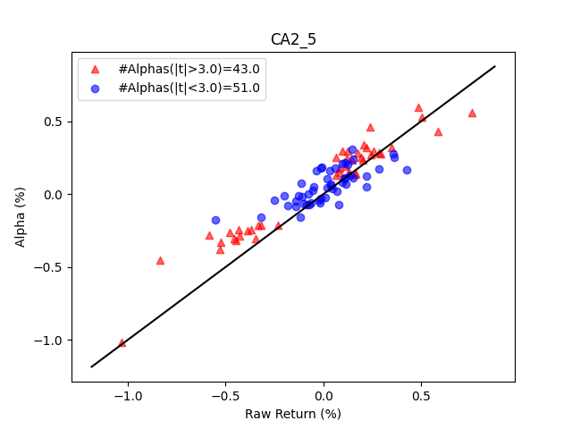
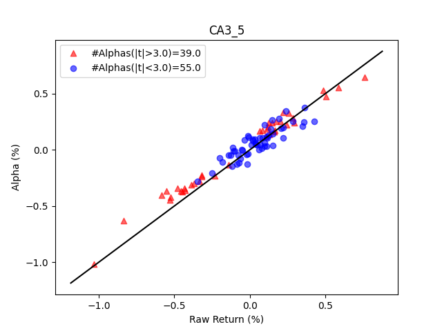

# Autoencoder-Asset-Pricing-Models

🧐 [**Report**](https://www.richardsong.live/autoencoder-asset-pricing-models) | [**Report PDF file**](https://cloud.tsinghua.edu.cn/f/c02804bed00b4083bcb7/?dl=1)
## Set Up

```bash
# generate preprocessed data and download portfolio returns
python data_prepare.py

# train models (ALL together)
python main.py --Model 'FF PCA IPCA CA0 CA1 CA2 CA3' --K '1 2 3 4 5 6'

# train models (selected models and K, for example)
python main.py --Model 'IPCA CA3' --K '5 6'

# analyze characteristics' importance (if needed)
python main.py --Model 'IPCA CA0 CA1 CA2 CA3' --K '5' --omit_char 'absacc acc age agr bm bm_ia cashdebt cashpr cfp cfp_ia chatoia chcsho chempia chinv chpmia convind currat depr divi divo dy egr ep gma grcapx grltnoa herf hire invest lev lgr mve_ia operprof orgcap pchcapx_ia pchcurrat pchdepr pchgm_pchsale pchquick pchsale_pchinvt pchsale_pchrect pchsale_pchxsga pchsaleinv pctacc ps quick rd rd_mve rd_sale realestate roic salecash saleinv salerec secured securedind sgr sin sp tang tb aeavol cash chtx cinvest ear ms nincr roaq roavol roeq rsup stdacc stdcf baspread beta betasq chmom dolvol idiovol ill indmom maxret mom12m mom1m mom36m mom6m mvel1 pricedelay retvol std_dolvol std_turn turn zerotrade'

# analyze models (calculate R^2, plot R^2 tables, bars and bias heatmap)
python analysis.py
```
## Results
### Total R^2 (%)


### Predict R^2 (%)


### Risk Premia v.s. Mispricing
<table>
<tr>
<td></td>
<td></td>
</tr>
<tr>
<td></td>
<td></td>
</tr>
<tr>
<td></td>
<td></td>
</tr>
</table>

### Characteristics Importance (reduced total R^2 (%), K=5)

